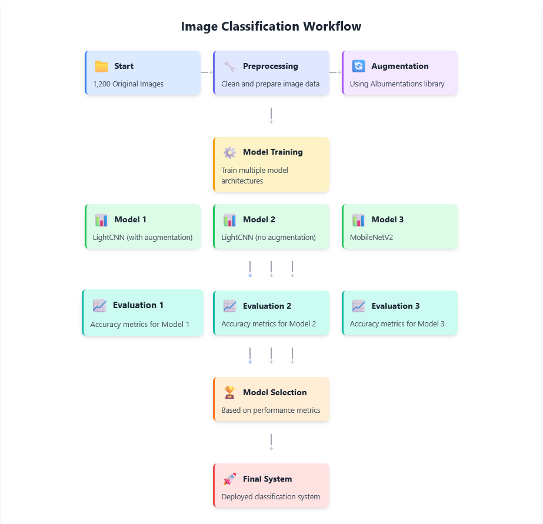

# The Librarian from Alexandria

**Team Members:**
- Mohammad Khair Hndauoi (794491)
- Julia Milliet Sciorra (E05228)
- Gabriele (806711)

## Introduction

This project is about building a CNN model that can recognize fonts from old manuscripts. We're trying to classify 11 different fonts: aureus, cicero, consul, florens, forum, laurel, optimus, pagella, roman, senatus, and trajan. We started with a dataset of around 1,200 images, which we expanded through augmentation to create a balanced dataset of about 8,000 images to train our models.

## Methods

For this project, we took a straightforward approach. We first explored the data to understand what we were working with. Then we used data augmentation to make our model better at handling the variations and oddities in ancient fonts. After that, we trained both a custom lightweight CNN model (with and without augmentations) and a pretrained MobileNetV2 model, tuning them to recognize the different font types as accurately as possible.

### Data Analysis and Preprocessing

When we first looked at our dataset, we found several challenges that needed to be addressed:

- The dataset had some class imbalance, with font representation varying from 86 samples (forum) to 142 samples (aureus)
- The images had very different dimensions, ranging from 1,854x2,645 pixels to 9,594x6,701 pixels
- There was format inconsistency - about 55% were RGB and 45% were grayscale
- The quality of images varied significantly with differences in blurriness and contrast

To handle these issues, we implemented preprocessing that:
1. Converted all grayscale images to RGB
2. Resized all images to fit within a 512x512 pixel square while keeping their aspect ratios (we actually ended up resizing them to 224x224 during training for the MobileNetV2 model as well as the custom model because 512x512 was too large for the GPU memory and kept crashing)
3. Placed the resized images on a white background to create uniform inputs
4. Normalized the pixel values to the range [0-1]

When we resized the images to 512x512, some ended up with white edges because the original dimensions didn't match the new square shape exactly. Our professor suggested removing these edges, but after some research, we found that CNNs usually learn to ignore them during training. Since our results were still good with the edges left in, and removing them would have meant starting over (which would take too long given the image sizes), we decided to keep them.

### Data Augmentation

To address the class imbalance and help our model generalize better, we used the Albumentations library for data augmentation. Our augmentation included:

- Rotation (up to 30 degrees)
- Adjustments to brightness and contrast
- Gaussian blur and image sharpening
- CLAHE (Contrast Limited Adaptive Histogram Equalization)
- Adjustments to hue, saturation, and value
- Small shifts and scaling
- Grid distortion and subtle elastic transformations

We tried to make the augmented data as different as possible from the original images. We calculated how many augmented images we needed for each font type to get around 850 samples per class. This approach increased our dataset from about 1,200 images to around 8,000 total images while making sure all classes were balanced.

### Model Architecture and Training

We designed a lightweight CNN architecture (LightCNN) as follows:

```
LightCNN(
  (features): Sequential(
    (0): Conv2d(3, 32, kernel_size=(3, 3), stride=(1, 1), padding=(1, 1))
    (1): ReLU()
    (2): MaxPool2d(kernel_size=2, stride=2, padding=0)
    (3): Conv2d(32, 64, kernel_size=(3, 3), stride=(1, 1), padding=(1, 1))
    (4): ReLU()
    (5): MaxPool2d(kernel_size=2, stride=2, padding=0)
    (6): Conv2d(64, 128, kernel_size=(3, 3), stride=(1, 1), padding=(1, 1))
    (7): ReLU()
    (8): MaxPool2d(kernel_size=2, stride=2, padding=0)
    (9): Conv2d(128, 256, kernel_size=(3, 3), stride=(1, 1), padding=(1, 1))
    (10): ReLU()
    (11): AdaptiveAvgPool2d(output_size=(7, 7))
  )
  (classifier): Sequential(
    (0): Dropout(p=0.5)
    (1): Linear(in_features=12544, out_features=11, bias=True)
  )
)
```

We also used a pretrained MobileNetV2 model as a baseline for comparison. We modified its architecture like this:

```python
def create_model(num_classes=11, freeze_layers=True):
    # Load pre-trained MobileNetV2
    model = models.mobilenet_v2(weights="IMAGENET1K_V1")

    # Freeze early layers to preserve learned features
    if freeze_layers:
        for param in list(model.parameters())[:-8]:  # Freeze all but the last few layers
            param.requires_grad = False

    # Replace the final fully connected layer
    in_features = model.classifier[1].in_features
    model.classifier[1] = nn.Linear(in_features, num_classes)

    return model
```

For the training process, we included:
- Memory-efficient image caching with our custom FontDataset class
- Hyperparameter optimization using Optuna
- Stratified dataset splitting to keep class balance in training, validation, and test sets
- Early stopping and learning rate scheduling to prevent overfitting

### Development Environment

We trained our model using PyTorch with torch_directml for GPU acceleration on an AMD RX 6600 XT graphics card. The training was done on a Windows 10 machine with:
- CPU: AMD Ryzen 5 5600X
- RAM: 32 GB
- GPU: AMD RX 6600 XT
- OS: Windows 11
- Python: 3.10.11

<div align="center">
  
  <p><em>Figure 1: Overview of the font classification pipeline showing the data preprocessing, augmentation, and model training stages.</em></p>
</div>

## Experimental Design

Our experiments were designed to see how effective our CNN model would be for ancient font classification, and to evaluate the impact of our data augmentation and preprocessing strategies.

### Main Purpose

The main goal was to determine if our lightweight CNN architecture could accurately classify 11 different ancient font types from manuscript images, even with the challenges of limited training data, class imbalance, and varying image quality.

### Baselines

We compared our approach with two baselines:

1. Basic CNN without augmentation: A similar CNN architecture trained only on the original dataset (about 1,200 images) without any data augmentation. This helped us see how much our augmentation strategy improved performance.

2. Transfer learning with MobileNetV2: We fine-tuned a pretrained MobileNetV2 model on our dataset as a more complex baseline. This comparison helped us see if our simpler custom architecture could achieve similar results to a deeper, more complex model while using fewer resources.

### Evaluation Metrics

We used several metrics to thoroughly evaluate our model's performance:

1. Overall accuracy: The percentage of correctly classified images across all font types, giving us a simple measure of overall performance.

2. Per-class precision, recall, and F1-score: These metrics helped us understand how well the model performed for each individual font type:
  - Precision: How well the model avoided misclassifying samples as a particular font
  - Recall: How well the model found all samples of a particular font
  - F1-score: The balance between precision and recall

3. Confusion matrix: This helped us identify specific patterns of misclassification between font types, showing which fonts were most easily confused with each other.

We chose these metrics because font classification has unique challenges where certain font pairs might look very similar. Using both overall accuracy and per-class metrics helped us identify not just how well the model performed on average, but also if it struggled with specific font types.

## Results

Our experiments showed some important findings about ancient font classification using CNNs.

### Main Findings

Our LightCNN model with augmented data achieved impressive results:

- Overall accuracy: 93.02% on the test set, which was significantly better than our baselines
- Per-class performance: F1-scores ranged from 0.84 to 0.99, with most classes exceeding 0.90
- Augmentation impact: Training with our augmented dataset improved accuracy by about 16.4% compared to training on just the original dataset (93.02% vs 76.59%)

When we compared the different models, our LightCNN with augmentation outperformed both the non-augmented version and the MobileNetV2 model:

| Metric | LightCNN (With Augmentation) | LightCNN (No Augmentation) | MobileNet V2 |
|--------|----------------------|---------------------------|----------------------------|
| Accuracy | 93.02% | 76.59% | 81.42% |
| Macro Average F1-Score | 0.93 | 0.77 | 0.81 |
| Weighted Average F1-Score | 0.93 | 0.76 | 0.81 |

*Table 1: Comparison of performance metrics across different model architectures and training strategies.*

The confusion matrix for our best model (LightCNN with augmentation) showed:

```
[[151   0   4   1   1   1   0   2   1   0  12]
 [  0 169   0   0   1   0   0   0   0   0   0]
 [  0   0 179   1   1   0   0   0   0   0   9]
 [  3   2   0 178   0   0   0   2   1   0   0]
 [  0   0   0   1 171   0   0   0   0   0   1]
 [  0   0   1   0   0 167   2   0   0   0   2]
 [  0   2   0   3   0   2 175   1   0   1   0]
 [  0   4   1   9   0   1   2 153  11   1   0]
 [  1   2   0   2   2   0   0   8 174   0   0]
 [  0   1   0   1   0   1   0   0   0 177   0]
 [  9   1  17   1   1   0   4   1   0   0 158]]
```
*Figure 2: Confusion matrix showing the distribution of predicted vs. actual font types for the LightCNN model with augmented data.*

Looking at per-class performance for our best model:

| Font Class | Precision | Recall | F1-Score |
|------------|-----------|--------|----------|
| Class 0    | 0.92      | 0.87   | 0.90     |
| Class 1    | 0.93      | 0.99   | 0.96     |
| Class 2    | 0.89      | 0.94   | 0.91     |
| Class 3    | 0.90      | 0.96   | 0.93     |
| Class 4    | 0.97      | 0.99   | 0.98     |
| Class 5    | 0.97      | 0.97   | 0.97     |
| Class 6    | 0.96      | 0.95   | 0.95     |
| Class 7    | 0.92      | 0.84   | 0.88     |
| Class 8    | 0.93      | 0.92   | 0.93     |
| Class 9    | 0.99      | 0.98   | 0.99     |
| Class 10   | 0.87      | 0.82   | 0.84     |

*Table 2: Per-class performance metrics for the LightCNN model with data augmentation.*

Our results showed that:

1. Data augmentation was crucial for getting high accuracy, improving our LightCNN model's performance by over 16 percentage points
2. Our lightweight CNN architecture performed better than MobileNet V2 (93.02% vs 81.42%), showing that a carefully designed, domain-specific architecture can outperform general-purpose architectures
3. Some font classes (4, 5, 6, and 9) were particularly well-classified with F1-scores above 0.95
4. The most challenging font classes were 7 and 10, with F1-scores of 0.88 and 0.84
5. The confusion matrix shows that class 10 was often misclassified as class 2 (17 instances), and class 0 was confused with class 10 (12 instances)

We focused on evaluating models based on realistic performance rather than just the highest scores, to avoid showing results that might be due to overfitting. That's why we considered not just accuracy, but also F1 scores (both macro and weighted) and the confusion matrix.

## Conclusions

Our project successfully showed that a lightweight CNN architecture combined with effective preprocessing and data augmentation can accurately classify ancient font types from manuscript images with over 93% accuracy. Our approach balanced efficiency with performance, achieving better results than MobileNetV2 while using fewer parameters. 

The careful attention to dataset preparation, including standardizing image dimensions, addressing class imbalance through targeted augmentation, and quality normalization, was essential to improving accuracy by more than 16 percentage points compared to training on the original dataset alone.

While our project achieved good results, there were some limitations. We had a relatively small original dataset (only about 1,200 images), which required extensive augmentation. A larger dataset with more diverse samples could further improve model performance. We also faced hardware constraints, as we didn't have access to an Nvidia GPU for CUDA support and had to use alternatives like torch_directml for AMD GPUs.

In the future, expanding the dataset (even spending some more work on augmentations) and using more powerful hardware could help optimize the training and evaluation processes. This project wasn't meant to be production-level, but our approach shows promising results for practical applications in analyzing historical manuscripts.