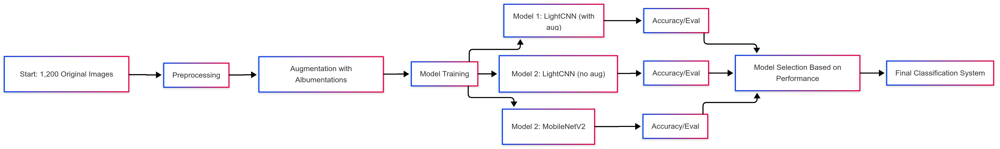

# The Librarian from Alexandria

**Team Members:**
- Mohammad Khair Hndauoi (794491)
- Julia Milliet Sciorra (E05228)
- Gabriele (806711)

## Introduction

This project is about building a CNN that can recognize fonts from old manuscripts. There are 11 fonts we're trying to classify: aureus, cicero, consul, florens, forum, laurel, optimus, pagella, roman, senatus, and trajan. We used a dataset of 1,200 images, which we augmented to create a balanced dataset of 8,000 images.

## Methods

We followed a pretty simple flow. First we explored the data to see what we were working with. Then we used data augmentation to help the model deal with the weirdness and variety in old fonts. After that, we trained a CNN model (with and without augmentations) and a pretrained model (MobileNetV2) and tuned them to recognize the different fonts as accurately as possible.

### Data Analysis and Preprocessing

We began by analyzing our dataset of manuscript images containing 11 distinct font types: aureus, cicero, consul, florens, forum, laurel, optimus, pagella, roman, senatus, and trajan. Initial analysis revealed several challenges:

- **Class imbalance**: Font representation varied from 86 samples (forum) to 142 samples (aureus)
- **Dimensional variability**: Images ranged from 1,854×2,645 pixels to 9,594×6,701 pixels
- **Format inconsistency**: 55% RGB and 45% grayscale images
- **Quality variation**: Significant differences in blurriness and contrast across fonts

To address these issues, we implemented a preprocessing pipeline that:
1. Converted all grayscale images to RGB format
2. Resized images to fit within a 512×512 pixel square while preserving aspect ratios
3. Placed resized images on a white background to create uniform inputs
4. Normalized pixel values to the range [0-1]

### Data Augmentation

To address class slight imbalance and improve model generalization, we implemented data augmentation using the Albumentations library. Our augmentation pipeline included:

- Rotation (up to 30 degrees)
- Brightness and contrast adjustments
- Gaussian blur and image sharpening
- CLAHE (Contrast Limited Adaptive Histogram Equalization)
- Hue/saturation/value adjustments
- Small shifts and scaling
- Grid distortion and subtle elastic transformations

We used a class-specific augmentation strategy, calculating the necessary augmentation multiplier for each font type to achieve approximately 850 samples per class. This approach increased our dataset from about 1,200 images to around 8,000 total images while ensuring class balance.

### Model Architecture and Training

We designed a lightweight CNN architecture (LightCNN) as follows:

```
LightCNN(
  (features): Sequential(
    (0): Conv2d(3, 32, kernel_size=(3, 3), stride=(1, 1), padding=(1, 1))
    (1): ReLU()
    (2): MaxPool2d(kernel_size=2, stride=2, padding=0)
    (3): Conv2d(32, 64, kernel_size=(3, 3), stride=(1, 1), padding=(1, 1))
    (4): ReLU()
    (5): MaxPool2d(kernel_size=2, stride=2, padding=0)
    (6): Conv2d(64, 128, kernel_size=(3, 3), stride=(1, 1), padding=(1, 1))
    (7): ReLU()
    (8): MaxPool2d(kernel_size=2, stride=2, padding=0)
    (9): Conv2d(128, 256, kernel_size=(3, 3), stride=(1, 1), padding=(1, 1))
    (10): ReLU()
    (11): AdaptiveAvgPool2d(output_size=(7, 7))
  )
  (classifier): Sequential(
    (0): Dropout(p=0.5)
    (1): Linear(in_features=12544, out_features=11, bias=True)
  )
)
```


#### Pretrained Model: MobileNetV2

We also utilized a pretrained MobileNetV2 model for comparison. The architecture was modified as follows:

```python
def create_model(num_classes=11, freeze_layers=True):
    # Load pre-trained MobileNetV2
    model = models.mobilenet_v2(weights="IMAGENET1K_V1")

    # Freeze early layers to preserve learned features
    if freeze_layers:
        for param in list(model.parameters())[:-8]:  # Freeze all but the last few layers
            param.requires_grad = False

    # Replace the final fully connected layer
    in_features = model.classifier[1].in_features
    model.classifier[1] = nn.Linear(in_features, num_classes)

    return model
```

#### Training Process

The training process included:
- **Memory-efficient image caching**: The custom `FontDataset` class cached transformed images in memory to accelerate training.
- **Hyperparameter optimization**: We used Optuna to efficiently search for optimal learning rate, batch size, and optimizer type.
- **Stratified dataset splitting**: To maintain class balance, we used stratified splitting for training, validation, and test sets.
- **Early stopping and learning rate scheduling**: To prevent overfitting and improve convergence.

### Development Environment

Our model was trained using PyTorch with torch_directml for GPU acceleration on an AMD RX 6600 XT graphics card. The training process was conducted on a Windows 10 machine with the following specifications:
- **CPU**: AMD Ryzen 5 5600X
- **RAM**: 32 GB
- **GPU**: AMD RX 6600 XT
- **OS**: Windows 11
- **Python**: 3.10.11


*Figure 1: Overview of the font classification pipeline showing the data preprocessing, augmentation, and model training stages (Mermaid Chart).*

<<<<<<< HEAD

*Figure 1: Overview of the font classification pipeline showing the data preprocessing, augmentation, and model training stages.*

=======
>>>>>>> 066b1bc420d40f74c55c22d5c04aff02b16cda6d
## Experimental Design

Our experimental design focused on assessing the effectiveness of our CNN model for ancient font classification while evaluating the impact of our data augmentation and preprocessing strategies.

### Main Purpose

The primary goal of our experiments was to determine whether our lightweight CNN architecture could accurately classify 11 different ancient font types from manuscript images, even with the challenges of limited training data, class imbalance, and image quality variations.

### Baselines

We compared our approach against two baselines:

1. **Basic CNN without augmentation**: A similar CNN architecture trained only on the original, preprocessed dataset (approximately 1,200 images) without any data augmentation. This baseline helped us quantify the impact of our augmentation strategy.

2. **Transfer learning with MobileNetV2**: We fine-tuned a pre-trained MobileNetV2 model on our dataset as a more complex baseline. This comparison helped us evaluate whether our lightweight custom architecture could achieve comparable results to a deeper, more complex model while requiring fewer computational resources.

### Evaluation Metrics

We selected several complementary metrics to thoroughly evaluate our model's performance:

1. **Overall accuracy**: The proportion of correctly classified images across all font types. This provided a straightforward measure of overall model performance.

2. **Per-class precision, recall, and F1-score**: These metrics helped us understand how well the model performed for each individual font type:
  - Precision: The ability of the model not to misclassify samples as a particular font
  - Recall: The ability of the model to find all samples of a particular font
  - F1-score: The harmonic mean of precision and recall, balancing both concerns

3. **Confusion matrix**: This visualization helped us identify specific patterns of misclassification between font types, revealing which fonts were most easily confused with each other.

We chose these metrics because font classification presents unique challenges where certain font pairs might be visually similar and easily confused. The combination of overall accuracy with per-class metrics allowed us to identify not only how well the model performed on average but also whether it struggled with specific font types. This detailed analysis was crucial for understanding the practical applicability of our model in real-world historical document analysis.

## Results

Our experiments yielded several significant findings regarding ancient font classification using CNNs.

### Main Findings

Our LightCNN model achieved impressive results when trained on the augmented dataset:

- **Overall accuracy**: 93.02% on the test set, significantly outperforming our baselines
- **Per-class performance**: F1-scores ranged from 0.84 to 0.99 (a bit suspicious), with most classes exceeding 0.90
- **Augmentation impact**: Training with our augmented dataset improved accuracy by approximately 16.4% compared to training on the original dataset alone (93.02% vs 76.59%)

The confusion matrix revealed interesting patterns in font classification:

```
[[151   0   4   1   1   1   0   2   1   0  12]
 [  0 169   0   0   1   0   0   0   0   0   0]
 [  0   0 179   1   1   0   0   0   0   0   9]
 [  3   2   0 178   0   0   0   2   1   0   0]
 [  0   0   0   1 171   0   0   0   0   0   1]
 [  0   0   1   0   0 167   2   0   0   0   2]
 [  0   2   0   3   0   2 175   1   0   1   0]
 [  0   4   1   9   0   1   2 153  11   1   0]
 [  1   2   0   2   2   0   0   8 174   0   0]
 [  0   1   0   1   0   1   0   0   0 177   0]
 [  9   1  17   1   1   0   4   1   0   0 158]]
```
*Figure 2: Confusion matrix showing the distribution of predicted vs. actual font types for the LightCNN model with augmented data.*

| Metric | LightCNN (With Augmentation) | LightCNN (No Augmentation) | MobileNet V2 |
|--------|----------------------|---------------------------|----------------------------|
| Accuracy | 93.02% | 76.59% | 81.42% |
| Macro Average F1-Score | 0.93 | 0.77 | 0.81 |
| Weighted Average F1-Score | 0.93 | 0.76 | 0.81 |

*Table 1: Comparison of performance metrics across different model architectures and training strategies.*

### Performance by Font Type

| Font Class | Precision | Recall | F1-Score |
|------------|-----------|--------|----------|
| Class 0    | 0.92      | 0.87   | 0.90     |
| Class 1    | 0.93      | 0.99   | 0.96     |
| Class 2    | 0.89      | 0.94   | 0.91     |
| Class 3    | 0.90      | 0.96   | 0.93     |
| Class 4    | 0.97      | 0.99   | 0.98     |
| Class 5    | 0.97      | 0.97   | 0.97     |
| Class 6    | 0.96      | 0.95   | 0.95     |
| Class 7    | 0.92      | 0.84   | 0.88     |
| Class 8    | 0.93      | 0.92   | 0.93     |
| Class 9    | 0.99      | 0.98   | 0.99     |
| Class 10   | 0.87      | 0.82   | 0.84     |

*Table 2: Per-class performance metrics for the LightCNN model with data augmentation.*

Our results demonstrated that:

1. Data augmentation was crucial for achieving high accuracy, improving the LightCNN model's performance by over 16 percentage points
2. Our lightweight CNN architecture outperformed MobileNet V2 (93.02% vs 81.42%), demonstrating that a carefully designed, domain-specific architecture can exceed the performance of general-purpose architectures
3. Certain font classes (4, 5, 6, and 9) were particularly well-classified with F1-scores above 0.95
4. The most challenging font classes were 7 and 10, with F1-scores of 0.88 and 0.84 respectively
5. The confusion matrix reveals that class 10 was often misclassified as class 2 (17 instances), and class 0 was confused with class 10 (12 instances)

These results validate our approach of combining a lightweight CNN architecture with extensive data augmentation for the task of ancient font classification. The high accuracy achieved (93.02%) demonstrates the practical viability of this system for assisting scholars and archivists in the analysis of historical manuscripts.

## Conclusions

### Key Takeaways

This project has successfully demonstrated that a lightweight CNN architecture, when combined with effective preprocessing and data augmentation strategies, can accurately classify ancient font types from manuscript images with over 93% accuracy. Our approach balanced computational efficiency with classification performance, achieving better results than MobileNet V2 while requiring fewer parameters. The careful attention to dataset preparation, including standardization of image dimensions, addressing class imbalance through targeted augmentation, and quality normalization, proved essential to improving accuracy by more than 16 percentage points compared to training on the original dataset alone.

### Limitations and Future Work

While our project achieved promising results, there were some limitations:

1. **Limited dataset size**: The original dataset contained only 1,200 images, which required extensive augmentation to create a balanced dataset. A larger dataset with more diverse samples could further improve model performance.

2. **Hardware constraints**: We lacked access to an Nvidia GPU for CUDA support, which is widely used for deep learning. Instead, we relied on open-source alternatives like torch_directml for AMD GPUs. While effective, this setup posed challenges in terms of compatibility and performance.

Future work could address these limitations by expanding the dataset and leveraging more powerful hardware to optimize training and evaluation processes.
